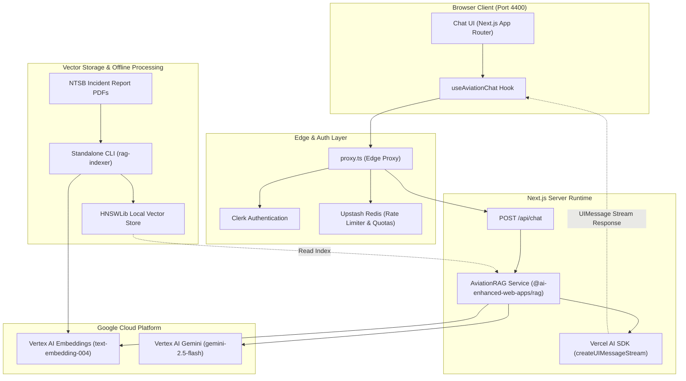

# Astra Aviation RAG

A Next.js 15+ conversational AI safety assistant that I designed to search and analyze NTSB aviation accident/incident reports using Retrieval-Augmented Generation (RAG) and local Hierarchical Navigable Small World (HNSW) vector indexing.

## Core Features

- **Contextual Search**: Query NTSB incident reports (covering Cessnas, icing, engine failures, etc.) using natural language.
- **Grounded Responses**: Uses Google Vertex AI (`gemini-2.5-flash`) to generate structured, fact-checked summaries directly from retrieved documents.
- **Hierarchical Navigable Small World (HNSW) Indexing**: Executes extremely fast semantic retrieval over serialized local HNSWLib databases.
- **Shared Architecture**: Reuses the core RAG components via the shared library `@ai-enhanced-web-apps/rag` and shared UI components from `@ai-enhanced-web-apps/chat-ui`.

## High-Level Architecture



## Dataset Source

The aviation dataset containing NTSB accident and incident reports is sourced from the [Docugami KG-RAG-datasets](https://github.com/docugami/KG-RAG-datasets) repository.

## Tech Stack

- **Framework**: Next.js 15+ (App Router)
- **AI Integrations**: Vercel AI SDK RSC, LangChain.js, `@langchain/google-vertexai`
- **Vector Search**: `hnswlib-node` (C++ native binder)
- **Styling**: Tailwind CSS, Radix UI

## Getting Started

### Prerequisites

Ensure you have authenticated Google Cloud Default Credentials (ADC) and set the following environment variables:

- `VERTEX_AI_PROJECT_ID`
- `VERTEX_AI_LOCATION` (defaults to `us-central1` if not provided)

If you haven't built the vector index yet, first run the standalone NestJS indexer CLI:

```bash
npm exec nx build rag-indexer
npx nx execute rag-indexer
```

### Running the App

Start the Next.js development server:

```bash
npm exec nx dev astra-aviation-rag
```

The application will run on port `4400`. Open [http://localhost:4400](http://localhost:4400) in your browser.

## Project Structure

- `src/app/(chat)/layout.tsx`: Chat layout containing the navigation header, main content wrapper, and footer.
- `src/app/(chat)/actions.tsx`: Vercel AI SDK Server Action (`continueConversation`) implementing the query execution chain and index path resolution.
- `src/app/(chat)/page.tsx`: Chat interface utilizing the shared components (AutoScroll, ChatList, WelcomeHeader) and hooks (useEnterSubmit).
- `src/app/layout.tsx`: Root HTML and Body shell container.
- `src/app/global.css`: Connects Tailwind CSS base styles and HSL color variables mapping.
