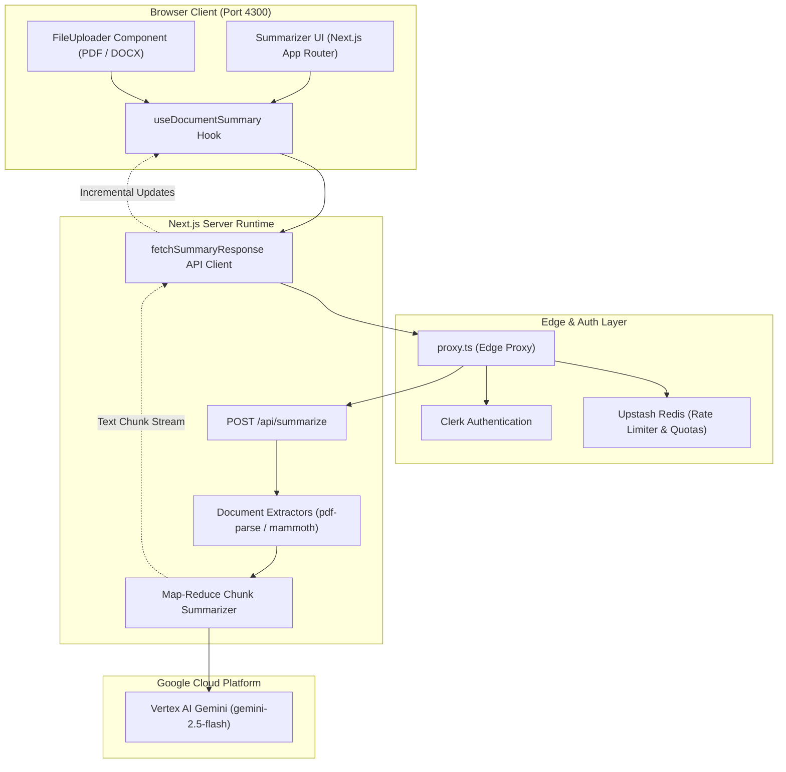

# Astra Document Summary: Conversational AI Summarizer

**Astra Document Summary** is a conversational AI web application that I designed specifically for document upload, parsing, and text summarization. I built the application to allow users to upload documents (PDF and DOCX formats) or paste raw text to receive cohesive, structured summaries powered by Google Gemini (via Vertex AI and the Vercel AI SDK).

### ✨ Key Features

- **Interactive Chat Interface**: Built as a single-page application featuring a welcome message, an input box for natural language queries, and a dedicated, scrollable area for conversation history.
- **Optimized User Experience (UX)**: Implements features like loading indicators, Markdown formatting, and **automatic scrolling** to smoothly manage long AI responses without overwhelming the user.
- **Real-Time Streaming**: Utilizes streaming responses to deliver AI-generated content incrementally in real-time, drastically reducing perceived wait times and improving user engagement.
- **Multimodal (Vision) Capabilities**: Upgraded to process both text and images, allowing users to upload an image and prompt the AI to analyze, interpret, or describe the visual content.
- **Structured Data Generation**: Capable of generating type-safe, structured JSON data instead of raw text, which allows the application to render organized UI elements like product tables.
- **Dual-State Management**: Efficiently separates **UI state** (what the user sees) and **AI state** (the context/history the model needs) to keep the application synchronized and secure.

### 📐 High-Level Architecture

### 🛠️ Technology Stack

- **Frontend**: I built this with **React.js** for modular UI components and styled it using the **Tailwind CSS** framework.
- **Backend & Routing**: I initially scaffolded the backend with Node.js, Express.js, and Vite, and then migrated the project to **Next.js**. My migration leverages Next.js's app router, file-based routing, and React Server Components (RSCs) for enhanced security and performance.
- **AI Orchestration**: I integrated the **Vercel AI SDK**, which solves major challenges like real-time streaming, UI/AI state management, and vendor lock-in.
- **LLM Providers**: I use an abstract factory pattern to seamlessly swap between **OpenAI (GPT-3.5/GPT-4)** and **Google Gemini** models via their public REST APIs.
- **Testing**: Includes automated unit testing set up using Vitest.
