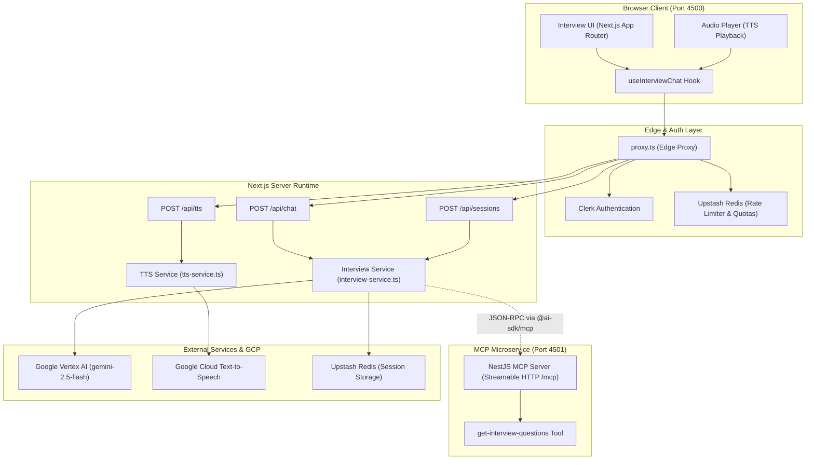

# Astra Interview Assistant

A Next.js-based conversational AI assistant that I designed to help job seekers practice for real-world interviews. Powered by Google Vertex AI, my application simulates realistic interview scenarios and provides personalized feedback using an LLM-powered interviewer.

## Features

- **Customizable Interviews:** Configure job type, difficulty, question type, and number of questions.
- **Voice Interactions:** Listen to the interviewer's questions using Google Cloud Text-to-Speech (TTS).
- **Session Management:** Save and resume interview sessions securely using Upstash Redis.
- **Personalized Feedback:** Get detailed, constructive feedback at the end of each session based on the entire conversation history.
- **Modern UI:** Built with Radix UI and Tailwind CSS.

## Architecture



I built the application on Next.js 15+ (App Router) and leveraged the following technologies:

- **Frontend Hooks:** Custom React hooks (`@ai-enhanced-web-apps/chat-hooks`) abstract away the `useChat` integration and audio playback.
- **Backend Services:** I encapsulated heavy operations like Redis state management, Vertex AI calls, and TTS synthesis in standard services (`interview-service.ts`, `tts-service.ts`) isolated from HTTP route handlers.
- **Authentication & Rate Limiting:** Secured with Clerk for user auth and Upstash Redis for sliding-window rate limiting.

## MCP Integration

I integrated this assistant with an experimental Model Context Protocol (MCP) server. When the user selects a "Frontend Engineer" job type with a "Technical" question type, my assistant leverages the `experimental_createMCPClient` from the Vercel AI SDK to stream connection and inject the MCP tools directly into the LLM context.

For more details on the server implementation, see the [Astra MCP Server README](../astra-mcp-server/README.md).

## Running Locally

To run the application locally, ensure you have your GCP credentials and environment variables set up, then run:

```bash
infisical run -- npx nx dev astra-interview-assistant
```

The application will be available at `http://localhost:4200` (or the port specified in your configuration).
