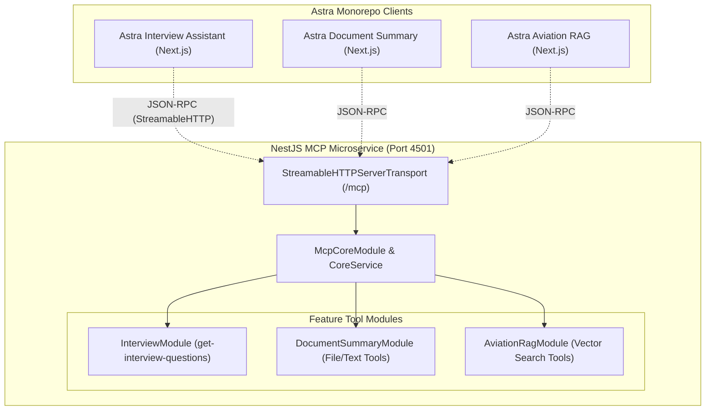

# Astra MCP Server

I built this experimental standalone NestJS server that implements the [Model Context Protocol (MCP)](https://modelcontextprotocol.io/) to provide specialized tool integrations for multiple AI applications within the Astra Monorepo.

## Features

- **Centralized MCP Integration:** Uses the official `@modelcontextprotocol/sdk` to expose backend tools and resources to LLMs via standard JSON-RPC.
- **Streamable HTTP Transport:** Leverages the modern `StreamableHTTPServerTransport` to provide stateful connections over a unified `/mcp` HTTP endpoint.
- **Modular Architecture:** Tools are organized by domain using NestJS feature modules:
  - **Interview Assistant:** Exposes the `get-interview-questions` tool to dynamically fetch curated technical interview questions.
  - **Document Summary:** Scaffolded to provide secure server-side file and text processing tools for `astra-document-summary`.
  - **Aviation RAG:** Scaffolded to expose aviation report vector search and document retrieval tooling for `astra-aviation-rag`.

## High-Level Architecture



## Running Locally

Serve the application locally using Nx:

```bash
npx nx serve astra-mcp-server
```

The MCP endpoint will be available at `http://localhost:4501/mcp`. Client applications should use the `StreamableHTTPClientTransport` to connect.
